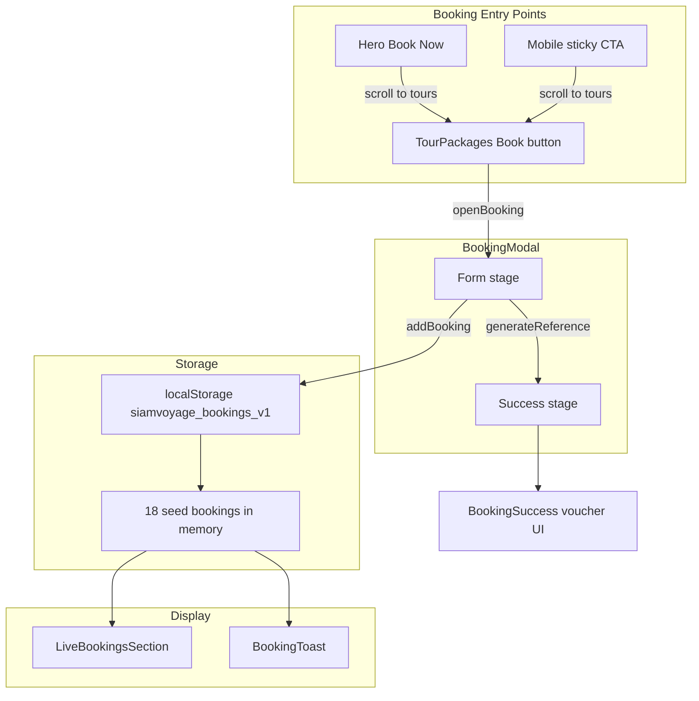
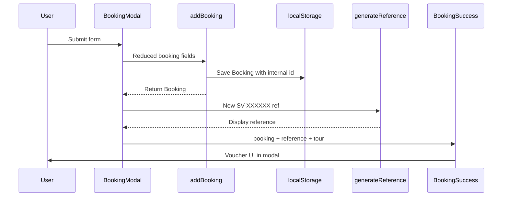

# Phase 1 — Project Analysis

Per [SIAM VOYAGE BOOKING WORKFLOW V1.md](SIAM%20VOYAGE%20BOOKING%20WORKFLOW%20V1.md), Phase 1 requires analysis only. **No code changes.**

---

## Architecture Snapshot

The app is a **client-only React 19 SPA** built with Vite 6 and Tailwind 4. Nearly all booking logic lives in a single monolith: [`src/App.tsx`](src/App.tsx) (~2,650 lines). There is **no backend, no router, no API, and no database**.



---

## 1. Current Booking Flow

### Entry points

| Trigger | Location | Behavior |
|---------|----------|----------|
| **Book** on tour card | `TourPackages` | Calls `openBooking(tourName)` → opens modal with pre-selected tour |
| **Book Now** (Hero) | `Hero` | Scrolls to `#tours` section (user picks a tour card) |
| **Mobile sticky CTA** | Root `App` | Scrolls to `#tours` after scroll > 500px |

Root state in `App` (lines ~2557–2586):

- `bookingOpen` / `bookingTour` control modal visibility and initial tour
- `useBookings()` provides `bookings` and `addBooking`

### Modal flow (`BookingModal`, lines ~1372–1664)

**Stage 1 — Form**

Collects:

- Tour package (select)
- Full name
- Country (select from `COUNTRIES`)
- Email
- Phone
- Start date
- Travelers (1–8)
- Special requests / notes (optional)

Also shows tour context: banner image, description, highlights, includes.

**Stage 2 — Success**

On submit (`handleSubmit`, lines ~1409–1428):

1. Name is split into `firstName` + `lastInitial`
2. Country resolved from `COUNTRIES` (stores `country` name + `flag` emoji)
3. `onBook()` → `addBooking()` persists a **reduced** record
4. A separate display reference is generated via `generateReference()` (format `SV-XXXXXX`, 6 random chars)
5. Modal switches to `stage: 'success'` and renders `BookingSuccess`

**Important gaps (relevant to later phases):**

- Email, phone, and notes are collected in the form but **never passed to `addBooking()`**
- Display reference (`SV-XXXXXX`) is **not stored** and is **not linked** to the persisted booking `id` (`user-{timestamp}-{random}`)
- No email is sent; timeline text says "Confirmation just hit your inbox" but that is UI copy only
- No QR code, PDF, or status field exists

### Post-booking visibility

After booking, the new record appears in:

- **LiveBookingsSection** — "Booking Today" (if `createdAt` is today) with a **You** badge (`isMine: true`)
- **BookingToast** — floating notification cycling through non-user bookings only (`!b.isMine`)

---

## 2. Current Booking Storage Method

### Primary storage: `localStorage`

| Property | Value |
|----------|-------|
| Key | `siamvoyage_bookings_v1` |
| Format | JSON array of `Booking` objects |
| Max user records | 50 (older entries trimmed via `.slice(0, 50)`) |
| Hook | `useBookings()` (lines ~341–379) |

### `Booking` type (lines ~60–71)

```typescript
type Booking = {
  id: string;           // e.g. "user-1719051234567-abc12" or "seed-0"
  firstName: string;
  lastInitial: string;
  country: string;
  flag: string;         // emoji, e.g. "🇬🇧"
  tour: string;
  travelers: number;
  startDate?: string;
  createdAt: number;    // Unix ms timestamp
  isMine?: boolean;     // true for user-created bookings
};
```

**Not stored:** email, phone, notes, status, booking reference, cancellation data.

### Secondary data: seed bookings

- `generateSeedBookings()` (lines ~322–337) creates **18 fake bookings** at runtime
- Merged with user bookings on load, sorted by `createdAt` descending
- Seed IDs: `seed-0` … `seed-17`
- Used for social proof in "People booking right now"
- **Not persisted** — regenerated on every page load

### Other browser storage

- `sessionStorage.plannerDismissed` — suppresses trip planner popup (unrelated to bookings)

### No server-side storage

- No Google Sheets integration (planned Phase 3)
- `express` and `@google/genai` are in `package.json` but unused in `src/`

---

## 3. Voucher Generation Flow

There is **no server-generated voucher**. The "voucher" is a **client-side success screen** inside the booking modal.



### Reference generation (`generateReference`, lines ~400–405)

- Format: `SV-` + 6 random alphanumeric chars (excludes ambiguous chars)
- Generated **after** save, stored only in modal state (`confirmation.ref`)
- **Not persisted** — lost when modal closes
- **Not equal** to stored `booking.id`

### Voucher UI (`BookingSuccess`, lines ~1666–1827)

Displays:

- Success headline ("You're going to Thailand")
- Reference card with tour image, `reference`, tour name, travel date, guest count
- Copy-to-clipboard for reference
- "What happens next" timeline (3 steps; first marked done)
- Actions: "Continue exploring" (closes modal), share/copy button

Does **not** include:

- QR code
- Email delivery
- PDF download
- Persistent voucher URL or page

### Related: Car rental reference (separate flow)

`CarRentalModal` generates a `CR-XXXXXX` reference in component state only — **not persisted**, not part of tour booking storage.

---

## 4. Components Involved

All components are defined inline in [`src/App.tsx`](src/App.tsx):

| Component | Lines (approx.) | Role in booking |
|-----------|-----------------|-----------------|
| **`App`** (default export) | 2555–2649 | Root state, wires booking modal + live feed |
| **`useBookings`** (hook) | 341–379 | Load/save bookings, merge seeds |
| **`generateReference`** | 400–405 | Creates display reference |
| **`generateSeedBookings`** | 322–337 | Fake social-proof data |
| **`BookingModal`** | 1372–1664 | Form + success stages |
| **`BookingSuccess`** | 1666–1827 | Voucher / confirmation screen |
| **`TourPackages`** | ~1020+ | Tour cards with Book buttons |
| **`LiveBookingsSection`** | 1859–1933 | "People booking right now" section |
| **`BookingRow`** | 1830–1857 | Single booking row in live feed |
| **`BookingToast`** | 1936+ | Floating booking notification |
| **`Hero`** | ~821+ | Book Now scroll trigger |
| Mobile sticky CTA | 2637–2644 | Scroll-to-tours button |

### Supporting data/constants (same file)

| Symbol | Role |
|--------|------|
| `Booking` type | Booking data shape |
| `TourInfo` / `TOUR_CATALOG` / `TOURS` | Tour catalog (6 packages) |
| `COUNTRIES` | Country list with emoji flags |
| `SEED_PROFILES` / `SEED_OFFSETS_MIN` | Seed booking generator inputs |
| `timeAgo` / `isToday` | Display helpers for live feed |

### Components NOT involved in booking

`TripPlannerModal`, `ContactSection`, `CarRentalModal`, `Navbar`, `Footer`, `TestimonialMarquee`, `Services`, `WhyChooseUs`, `FinalCTA`, `SearchBar` — these are separate flows with no booking persistence.

---

## 5. Files Involved

| File | Relevance |
|------|-----------|
| [`src/App.tsx`](src/App.tsx) | **Primary** — all booking types, logic, UI, storage |
| [`src/main.tsx`](src/main.tsx) | React entry; mounts `<App />` |
| [`src/index.css`](src/index.css) | Design tokens (`--color-sunset`, `--color-ocean`, `--color-tropical-bg`) used by booking UI |
| [`index.html`](index.html) | HTML shell, fonts |
| [`package.json`](package.json) | React, Vite, Tailwind, motion, lucide-react; unused express/genai |
| [`vite.config.ts`](vite.config.ts) | Build config, `@/` alias, env injection |
| [`tsconfig.json`](tsconfig.json) | TypeScript config |
| [`src/assets/logo.svg`](src/assets/logo.svg) | Brand asset (not booking-specific) |

**Not present:** separate `components/`, `hooks/`, `types/`, `server/`, API routes, `.env`, router config, Google Sheets integration.

---

## Key Findings for Later Phases

These are observations only — **out of scope for Phase 1 implementation**:

1. **Monolith structure** — future work will heavily touch `App.tsx` unless files are split first
2. **Data loss on submit** — email, phone, notes collected but discarded
3. **Reference ID mismatch** — display ref vs stored id; Phase 3 wants `SV-YYYYMMDD-XXXX`
4. **No status field** — Phase 3 needs `Pending` default status
5. **Seed vs real mixing** — live feed merges both; Phase 11 wants priority rules
6. **Country flags** — stored as emoji strings; Phase 12 wants proper flag rendering
7. **No routing** — package pages (`/packages/...`) and office dashboard (`/office`) require new routes
8. **Voucher is modal-only** — no email, QR, or standalone voucher page yet

---

## Phase 1 Completion Criteria

Phase 1 is complete when the five required outputs are documented:

- [x] Current booking flow
- [x] Current booking storage method
- [x] Voucher generation flow
- [x] Components involved
- [x] Files involved

**Next step (Phase 2):** Create `DESIGN_SYSTEM.md` documenting colors, typography, buttons, forms, cards, shadows, radius, and layout — still no code changes.
